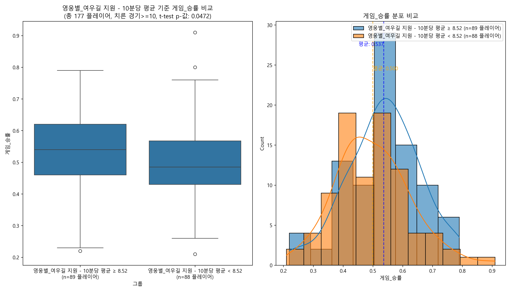

# 키리코, 뭘 잘해야 이길까? (데이터 까보기)

오케이, 키리코 판수 좀 박은 사람들 (10판 이상, 총 177명) 데이터 까서 뭐가 진짜 중요한지 알아봤음. 복잡한 거 빼고 핵심만 간다.

## 그림 1: 승률과 변인들의 상관관계

일단 단순하게 보면, `목숨당 처치`(안 죽고 킬/어시 많이 하는 거) 이게 승률이랑 제일 친했음. 그 다음은 `처치`, `쿠나이 처치`, `결정타` 같은 킬 관련 스탯들이 줄줄이 나왔고. `방어형 지원`(힐 준 아군이 킬)이나 `공격형 지원`(딜 넣은 적을 아군이 킬) 같은 것도 꽤 중요했음. `죽음`은 당연히 적을수록 좋았고 (빨간 막대 = 마이너스 관계).

근데 웃긴 건, 단순 `평균 치유량`은 여기 상위권에 끼지도 못함. 즉, 이때까지만 보면 힐만 오지게 넣는다고 이기는 건 아니라는 거.

하지만 늘 붙이듯.. 이기는 판들은 대체로 여유있어서 딜하기 편한 판들이 많을 수 있기에;; 인과관계 설명이 어려움. 다른 값들이 통제됐을 때의 승률 체크가 필요함.

## 그림 2: 진짜 승리 요인

**그림 2: SEM 경로 분석**

상관관계만 보면 '딜 잘 넣고 안 죽으면 장땡?' 싶지만, 세상일이 그렇게 단순하진 않지. 스탯끼리 서로 영향 주는 거 다 고려해서 진짜 승리에 직접적인 영향을 주는 놈을 찾아봤음 (SEM 분석).

이게 진짜 중요한 요인들만 남긴 최종 모델임. 화살표 색이 파란색이면 플러스 효과, 빨간색이면 마이너스 효과. 화살표 굵기는 영향력 크기. 별표() 많을수록 통계적으로 더 확실한 거고.

**방어형 지원이 제일 중요 (β=0.513)**: 내가 힐 준 아군이 적을 잡는 거. 이게 승률에 가장 큰 영향을 줌.
**목숨당 처치도 중요 (β=0.469)**: 죽지 않고 킬/어시 잘 하는 게 두 번째로 중요.
**치명타 처치도 유의미 (β=0.330)**: 쿠나이 헤드샷 터진 적이 킬로 연결되는 경우가 많을수록 승률도 올라감.
**무지성 딜 역효과 (β=-0.280)**:딜리코 금지.
**무지성 힐 역효과 (β=-0.315)**:힐리코는 딜리코보다도 더 큰 패배원인.
**여우길 지원은 조심 (β=-0.16)**: 궁극기를 막 쓰는 건 오히려 역효과. 타이밍이 중요. **솔직히 왜 음의 관계인지 모르겠음;**

## 참고: 능력치 높은 애들이 진짜 승률도 높은가? (T-test 비교)
SEM에서 중요하다고 나온 애들 +α 대상으로, 진짜 그 스탯 높은 애들이랑 낮은 애들이랑 승률 차이가 나는지 단순 비교해 본 거임.

*   **방어형 지원:** 높을수록 승률 높음 (O)
    
*   **목숨당 처치 (KDA):** 높을수록 승률 높음 (O)
    
*   **치명타 처치:** 높을수록 승률 높음 (O)
    
*   **쿠나이 처치:** 높을수록 승률 높음 (O)
    
*   **영웅에게 준 피해 (딜량):** 높을수록 승률 높음 (O)
    
*   **여우길 지원:** 높을수록 승률 *살짝* 낮음 (△) - SEM 결과랑 비슷
    
*   **(참고) 치유량:** 높은 그룹이나 낮은 그룹이나 승률 차이 없음 (X) - 이것도 SEM 결과랑 비슷하게, 힐량 자체만으론 승패랑 큰 관련 없어 보임. (이건 T-test 유의하지 않아서 이미지는 없음)

## 결론
1.  **방어형 지원이 가장 중요**: **내가 힐 준 아군이 적을 따내는 플레이**가 승률에 미치는 영향력이 가장 컸음. 아군 포커싱 지원, 힐 우선순위 판단이 중요함.
2.  **KDA 관리 필수 (`목숨당 처치`)**
3.  **힐리코 비추** 
4.  **힐리코 비추라고해서 딜딸만쳐도 승률은 뒤로감**
5.  **결론은 딜힐 벨런스 맞추면서, 탱이든 딜러든 킬변수에 기여하면 되는거임. 기왕이면 헤드샷 노리고** 

**특이사항: 여우길 지원은 근데 왜 높을수록 승률이 뒤로가냐; 존나신기하네**

오늘 패치되면서 아나 픽률이 급감함.. 게임 자체 양상이 많이 바뀐만큼
전시즌 데이터에 기반한 이 분석을 마냥 신뢰하기는 어려워졌음. 
그냥 참고만 해주면 좋겠다.
