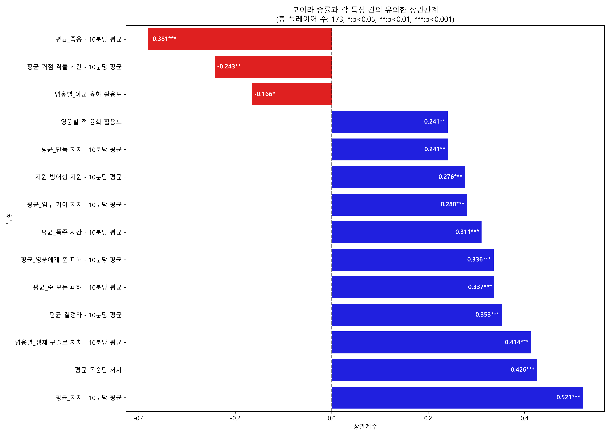

# 모이라 분석: 힐 vs 딜, 무엇이 승률을 결정하는가?

**밑에 세줄요약있음.**

글을 읽기에 앞서서 님들이 미리 알고있어야 할 스탯 정의가 있어서 먼저 작성함.

1.  **'방어형 지원'**은 '힐'을 받은 우리팀이 '킬'을 내야 그 값이 올라가는 값임 (좌클릭 포함).
2.  **'생체구슬\_처치'**는 딜구슬을 맞은 적이 죽었을때 오르는 스탯임.
    *   => 네가 딜구슬 섞어서 솔킬내도 1이 오르고, 우리팀이 다잡아가는거에 네가 딜구슬 한방울 섞어줘도 1이 오름.

힐모이라 vs 딜모이라 분석하기에는 표본이 적어, 분석을 위한 배틀태그들을 새로 수집하는데 시간이 좀 걸렸음. 다행히 표본이 좀 늘었고, 참고할만한 정도의 수는 되는 것 같아 작성함.

먼저 단순하게 승률 높은 모이라들은 어떤 스탯들도 높은지 확인해봤음. (그림 1).

까보니까, 힐 관련 스탯은 생각보다 순위가 낮거나 아예 없었음. '지원\_방어형 지원' 이게 그나마 힐 관련 변수긴 한데 엄청 높진 않고.. '치유량'은 승률이랑 상관이 없다고 나와버림.

대신 **'처치'**, **'목숨당 처치'** 같은 킬 관련 스탯이랑, 모이라 궁으로 적 때린거나 구슬로 킬 딴 거 같은 딜 관련 스탯들이 승률이랑 관련 깊게 나왔음. 물론 승률이 높을수록.. 이기는 판에선 게임이 비교적 원할하게 흘러갔을수도 있으니까, 딜관련 계수들이 높게 나왔을 가능성도 배제할순 없음.

따라서 승률에 직접적인 영향을 주는 변수는 어떤것이 있을까 단순한 구조방적식 모델링(SEM)을 돌려봤고 상관관계분석이랑은 조금 다른 결과를 얻음 (그림2).

결론부터 말하면, 다른 스탯들 영향 다 빼고 진짜로 승률에 직접 영향을 주는 놈은 딱 두 개였음:

*   **죽음 (β=-0.245\*\*)**: 이건 뭐 당연한 거지만, 덜 죽을수록 승률이 직접적으로 올라감. 상관관계에서도 중요했지만, 여기서도 살아남는 게 핵심이란 걸 보여줌.
*   **방어형 지원 (β=0.321\*\*)**: 이게 좀 흥미로운데, 케어받은 아군이 킬을 올렸을때 상승하는 방어형 지원이, 승률에 가장 큰 영향을 미치는 변수로 나타남.

상관관계 분석에선 킬 관련 스탯들(처치, 목처, 영웅딜 등)이 높아 보였지만, SEM분석에 따르면 승률에 직접 꽂히는 영향력은 생각보다 약했음.

상관관게분석에서 그래도 딜관련된 스탯이 그렇게 높았는데.. 표본을 늘리면 좀 다른 결과가 나올까 싶어서 2판 이상 플레이한 모이라들로 표본을 늘려봄 (그림3).

일단 **'죽음'(β=-0.260\*\*\*)**이랑 **'방어형 지원'(β=0.225\*)**은 여전히 승률에 영향 주는게 맞았음. 적게 죽으면서, 아군이 킬할 수 있도록 케어하는게 모이라 승리에 도움이 된다 정도의 해석은 여전히 유효함.

근데 이번엔 **'생체 구슬로 처치'(β=0.230\*)**가 새로운 유의미한 변수로 채택됐음.
막연히 '처치'나 '영웅딜' 같은 일반적인 딜 스탯보다는, '딜 구슬'로 킬에 기여하는게 진짜 승률이랑 직접적으로 연결된다는 거임.

네 구슬이 상대 힐러 궁게이지로 쓰였냐, 상대 킬내는데 쓰였냐가 승률에까지 영향을 미치는 요소라고 해석학고싶음.

---

## 결론

따라서 이번 분석을 통해서 개인적으로 내리는 결론은 아래와 같음.

1.  **힐/딜 구분은 무의미**:
    *   굳이 '힐만하는모이라' 또는 '딜만하는 모이라'를 팀으로 만난다면.. '생체구슬처치' 또는 '방어형지원' 둘중 하나가 삐꾸나기 때문에 좋은 모이라라고 보기 어려움.
2.  **구슬 활용의 중요성**:
    *   님들이 상상하는 것 이상으로 모이라의 구슬은, 승패여부에 중요한 스킬임.
    *   양 진영 아직 얼굴도 못봤는데 대충 딜구슬 던지면서 힐러궁 채워주는 모이라나.. 지 체력 조금 기스났다고 힐구슬 버리는 모이라는.. 폐급이 맞음.

아래는 몇 없는 모이라 유저들이 그나마 참고할 수 있도록 두 스탯의 평균을 뽑아낸 시각화임.
둘 중 한가지 스탯이 평균보다 못하다면, 그부분을 신경써주는게 승률 향상에 도움이 될 것임.

## 후기

생각보다 프로필 열어놓은 애들 중에 모이라 플레이하는애들이 별로 없었음;
추가로 배택 수집하느라 시간이 더 걸린듯.

그냥 그렇다고.

ㅅㄱ 
