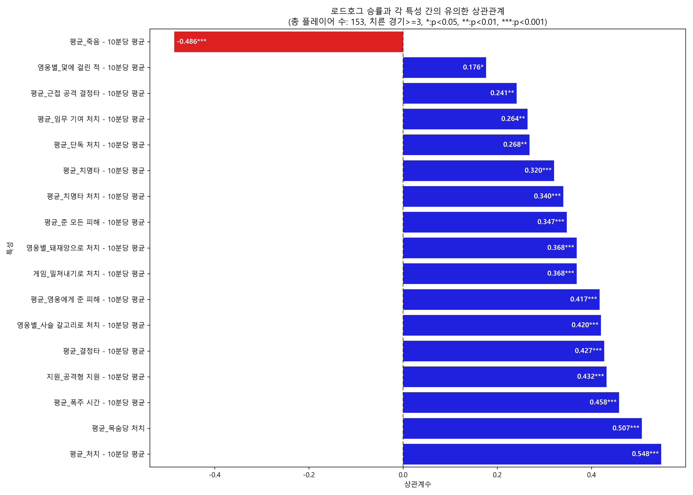
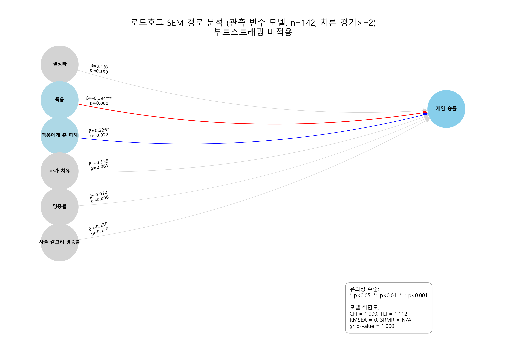
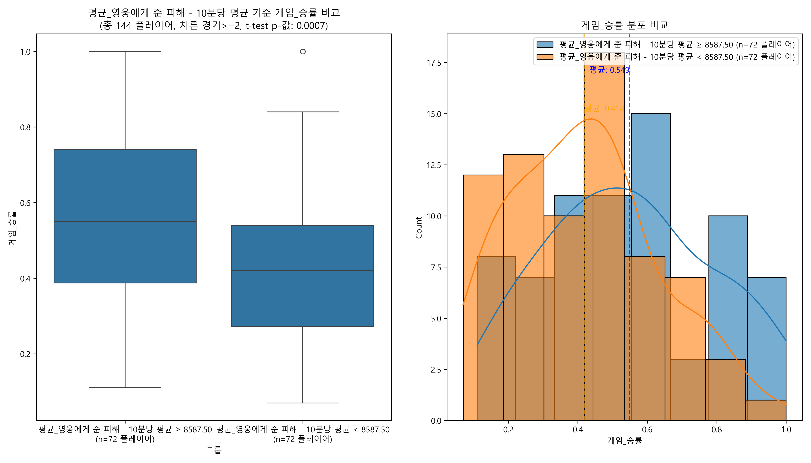
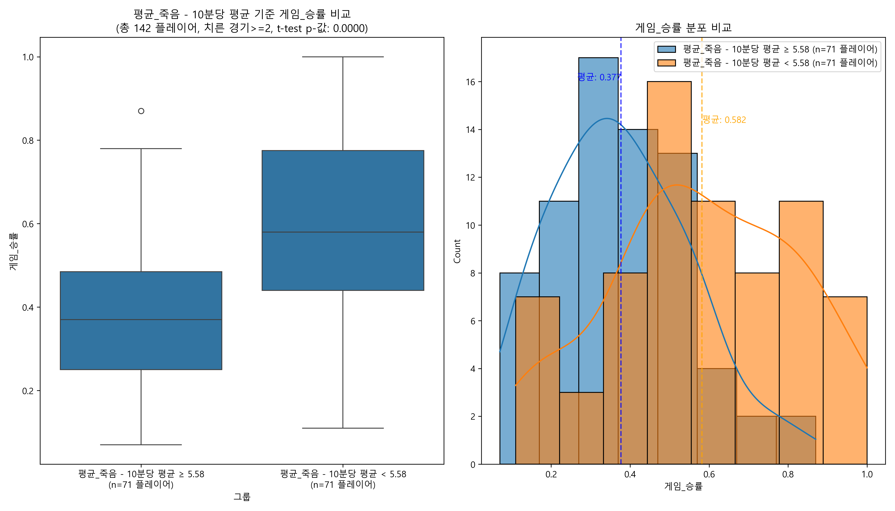

로드호그 분석 결과 공유함. 표본 수가 아주 많은 건 아니지만(최소 2판 플레이 유저 153명, 승률 데이터는 144명),
그래도 경향성은 볼 수 있을 것 같아서 정리해봄. 다른 분석 케이스와 다르게, 표본수나 변수들에 따라 그 영향력이 다르게 분석되는 편이었어서..
참고만 하면 좋겠음

먼저 단순하게 승률 높은 로드호그들은 어떤 스탯들이 높은지 상관관계부터 까봤음. (그림1)

(그림1)

예상대로 '처치', '목숨당 처치', '결정타', '영웅에게 준 피해' 같은 딜 관련 스탯들이 승률이랑 상관 높게 나왔음.
특히 '처치'가 제일 높았고, '목숨당 처치'도 상당히 높음.
로드호그의 핵심 스킬인 '사슬 갈고리로 처치'나 궁극기 '돼재앙으로 처치' 같은 것도 유의미하게 나왔고.
반대로 '죽음'은 역시나 승률이랑 강한 음의 상관관계를 보임. 덜 죽어야 이긴다는 건 뭐 당연한 소리.

근데 재밌는 건 '영웅별_자가 치유'나 '영웅별_사슬 갈고리 명중률' 자체는 생각보다 상관관계 순위가 낮았다는 거임.
물론 아예 상관없는 건 아니지만, 킬이나 생존 관련 지표보다는 후순위였음.
갈고리 명중률보단 그걸로 킬까지 이어가는 게 더 중요하다고 볼 수 있겠지.

물론 이건 단순 상관관계라, 승률 높은 판에서 다른 팀원들이 잘해서 로드호그 스탯도 덩달아 좋아 보였을 수도 있음.
그래서 승률에 진짜 '직접적인' 영향을 주는 변수가 뭘까 보려고
늘 그렇듯.. 구조방정식 모델링(SEM)을 돌려봤고, 영향 파악에 방해되는 변수들을 쳐내니까 최종적으로 딱 두 놈만 남았음. (그림2)

(그림2)

굳이 그림으로 첨부하진 않겠지만, 변수가 달라지면서 등장하기도 했던 변수들도 몇가지 읊어봄.
'죽음'은 항상 유의미하게 승률에 부정적인 영향을 끼쳤음.
'자가 치유'도 유의미하게 승률에 부정적인 영향을 끼치는 경우로 분석되는 경우도 종종 있었음.
'사슬 갈고리 명중률'도 유의미하게 승률에 긍정적 영향을 끼치는 경우가 있었음.
하지만 표본 수 문제, 판수 문제, 유의하지만 너무 낮은 베타값 등 이유로 제외, 그나마 참고할만한 결과가 위의 그림임.

결론부터 말하면, 다른 스탯들 영향 다 고려했을 때 진짜로 승률에 직접 영향을 주는 건 아래 두 개였음:

*   **죽음 (β = -0.394\*\*\*)**: 역시나... 덜 죽는 것이 승률에 가장 큰 직접적인 영향을 미침. 상관관계에서도 압도적이더니, 다른 변수 효과를 통제해도 생존의 중요성은 변하지 않음. 이게 가장 강력한 예측 변수였음.
*   **영웅에게 준 피해 (β = 0.226\*\*\*)**: 그 다음으로 영웅에게 주는 피해량이 승률에 직접적인 긍정적 영향을 주는 것으로 나타남. 단순히 킬/결정타 숫자보다는, 실질적으로 적 영웅들에게 얼마나 많은 딜 압박을 넣었는지가 승률과 직결된다는 의미임.

상관관계 분석에서는 '처치', '목숨당 처치', '갈고리 처치' 등이 아주 높아 보였지만,
SEM 분석에서는 이 스탯들이 승률에 미치는 직접적인 영향은 '죽음'과 '영웅에게 준 피해'라는 더 큰 요인들에 의해 가려지는 것으로 나타남.
즉, 로드호그는 생존하면서 꾸준히 적 영웅에게 딜 압박을 넣는 플레이가 승률 상승의 핵심이라고 해석할 수 있음.

변수나 표본이 어떻게 변하더라도 '죽음'이 항상 유의한 영향을 끼치던 점은, 탱커다운 부분이라고 해석할수도 있겠지.

이번 로드호그 분석을 통해 내리는 결론은 다음과 같음:

1.  로드호그 승률의 제1원칙은 '생존'임. 아무리 갈고리 잘 끌고 딜 우겨넣어도 자주 잘리면 승률 나락 가는 건 순식간임.
2.  '영웅에게 준 피해'가 그 다음으로 중요함. 갈고리 킬도 물론 좋지만, 생존하면서 지속적으로 적에게 유효타를 누적시키는 것이 승률에 직접적인 영향을 미침.
3.  플랭킹 개쩔게 잘하는 로독이 승률이 높은거면 '단독처치'나 '갈고리처치'쪽에서 유의한 승률로 집계됐을텐데 그렇지 않은걸로 보아, 따로 혼자노는게 마냥 도움된다고 보긴 어렵다는거지.

아래에 영웅 10분평딜(그림3)이랑 평균 죽음(그림4) 관련 t-test 결과를 첨부하니, 참고하면 될듯.
기왕이면 평균보단 스탯 좋도록 노력하자.

(그림3)

(그림4)

후기:
솔직히 호그가 한두명 잘라내면 한타도 수월해지니까.. 단독처치나 그랩명중률 등이 당연히 채택될줄알았는데 유의x인 점이 신선했음.
그랩 명중률이고, 결정타고, 단독처치고 이런거 잘해서 나쁠거야 없겠다만..
영웅 평딜에 위 요소들이 기여할 수 있도록 플레이를 만들어가는게 생각보다 중요한 것 같음.

탱유저가 아니다보니 해석이 좀 조심스럽게되는듯.
호잘알분들의 지혜로운 댓글 기대해보겠음.
ㅅㄱ

**결론: 그랩명중/단처/결정타 이런게 안중요한건 아니지만.. 승률에 확실하게 영향주는 요소는 '영웅한테 딜 많이박고 덜잘리는거 ㅇㅇ'**
